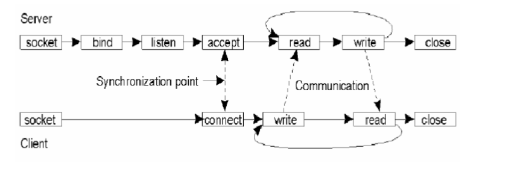
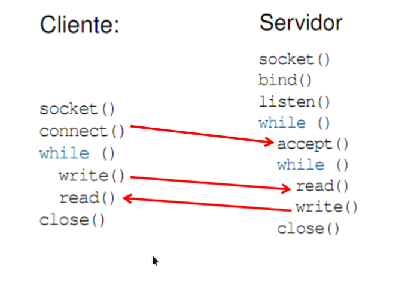

// Data: 27/06/2026
# Sockets
- **Funcionamento:** O servidor ficará esperando ligações, o Cliente irá ligar-se no servidor.
- Através dessa conexão é possivel uma comunicação bidirecional
- O SOCKET é o **extremo** da conexão

## comunicação
É feita através de troca de mensagens, as mensagens podem ser Strings, Inteiros, Floats, Objetos

## Servidor 
- Cria um ServerSocket
- Escuta no socket através do método `aceppt();` a espera de uma tentativa de conexão
- quando a conexão é estabelecida, podemos enviar e receber fluxo de dados
- depois de concluida a conexão, o servidor fecha a conexão
- e retorna ao passo dois para aguardar

## Cliente
- Cria um socket através do construtor da classe Socket
- tenta estabelecer uma conexão com o servidor
- uma vez conectado, envia e recebe fluxo de dados
- quando a conexão é concluida, fecha a conexão

# Classe ServerSocket(métodos)
- ServerSocket(int port): Cria um servidor Socket, limitado a uma porta especifica
- Socket aceppt(): fica esperando uma conexão com o socket e aceita ela
- void close(): fecha o socket
- InetAddress getInetAddress(): retorna o endereço local deste socket servidor

# Classe Socket(métodos)
- Socket(InetAddress address, int port): cria um socket e conecta ele a um número de porta especifico em um determinado endereço IP
- void close(): fecha o socket
- InetAddress getInetAddress(): Retorna o endereço no qual o socket está conectado
- boolean isClosed(): Retorna verdadeiro caso o Socket esteja fechado e falso para aberto
- boolean isConnected(): retorna o estado de conexão de socket

# Envio e recebimento de dados
Os dados são enviados através de fluxos de entrada e saida
Os métodos:
- **InputStream getInputStream():** retorna um fluxo de entrada para este socket
- **OutputStream get OutputStream():** retorna um fluxo de saida

